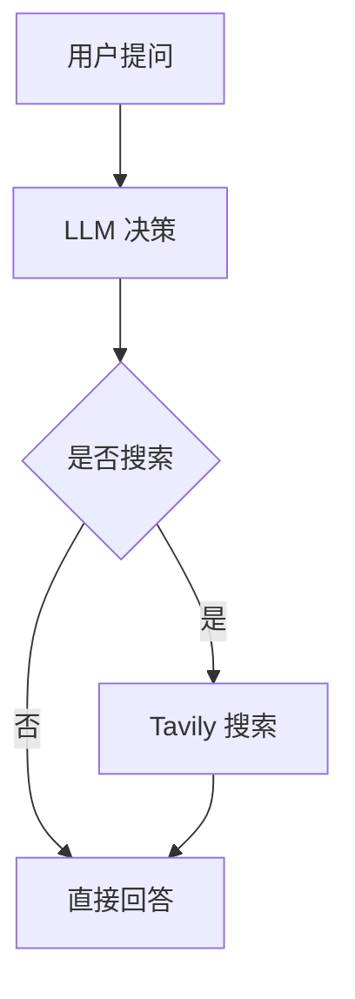

# Minimal Search Agent

一个基于 `FastAPI` 的搜索 Agent Demo，当前已经不是最早的单轮 MVP，而是一个带会话、流式输出、文件附件、Canvas 文档和基础中断控制的可运行原型。

## 当前能力

- DeepSeek 决策 `search / canvas / final`
- Tavily 搜索，默认返回 10 条结果
- 流式问答接口：`/api/ask/stream`
- 会话记忆：每个会话持久化为一个 Markdown 文件
- 历史会话列表与会话详情加载
- 用户中断：支持取消当前运行，并回滚未完成轮次
- 附件上传：支持 `PDF / TXT / MD`
- Canvas 文档：会话级 Markdown 文档生成、编辑、保存、下载
- Mermaid 渲染：回答区和 Canvas 预览支持 ` ```mermaid ` 代码块
- 工具观察层：工具执行成功/失败都会回填统一 observation

## 技术栈

- Backend: `FastAPI`
- LLM: `DeepSeek`
- Search: `Tavily`
- Frontend: 原生 HTML/CSS/JS
- Markdown: `marked` + `DOMPurify`
- Diagram: `Mermaid`

## 目录结构

```text
app/
  main.py
  runtime.py
  llm_client.py
  search_tool.py
  session_store.py
  attachment_store.py
  artifact_store.py
  artifact_tool.py
  run_manager.py
  schemas.py
templates/
  index.html
tests/
target/
  sessions/
  uploads/
  artifacts/
```

## 安装

```bash
pip install -r requirements.txt
```

## 配置

复制 `.env.example` 到 `.env`：

```bash
copy .env.example .env
```

必填：

- `DEEPSEEK_API_KEY`
- `TAVILY_API_KEY`

常用配置：

- `DEEPSEEK_MODEL=deepseek-chat`
- `DEEPSEEK_BASE_URL=https://api.deepseek.com`
- `SEARCH_TOP_K=10`
- `LLM_REQUEST_TIMEOUT=90`
- `SEARCH_REQUEST_TIMEOUT=20`
- `LOG_LEVEL=INFO`
- `PROXY_URL=`

## 启动

```bash
uvicorn app.main:app --reload
```

打开：

- `http://127.0.0.1:8000`

## 主要接口

- `POST /api/ask`
  同步返回完整答案
- `POST /api/ask/stream`
  流式返回 NDJSON 事件
- `POST /api/runs/{run_id}/cancel`
  取消当前运行
- `GET /api/sessions`
  会话列表
- `GET /api/sessions/{session_id}`
  会话详情
- `DELETE /api/sessions/{session_id}`
  删除会话、附件和文档
- `GET /api/sessions/{session_id}/artifacts`
  会话文档列表
- `POST /api/sessions/{session_id}/artifacts/save`
  创建或更新 Markdown 文档
- `GET /api/sessions/{session_id}/artifacts/{artifact_id}`
  读取文档
- `GET /api/sessions/{session_id}/artifacts/{artifact_id}/download`
  下载 Markdown 文档

## 运行机制

一次完整问答大致是：

1. 前端提交问题和可选附件
2. Runtime 调用 DeepSeek 决策动作
3. 若动作为 `search`，调用 Tavily 检索并把结果回填给模型
4. 若动作为 `canvas`，保存或更新会话级 Markdown 文档
5. 最终输出 `final`
6. 当前轮成功后才写入会话记忆

中断策略采用“整轮原子提交”：

- 运行中可以取消
- 未完成轮次不会写入会话记忆
- 附件和 Canvas 副作用会回滚
- 会话恢复到上一轮完成状态

## Mermaid 使用方式

回答区和 Canvas 预览支持 Mermaid 代码块，例如：

````md

````

当前更适合用 Mermaid 画：

- 流程图
- 时序图
- 架构图

如果要做柱状图、折线图、饼图这类数据图表，后续更建议接 `ECharts` 或 `Chart.js`，不要继续用 Mermaid 模拟统计图。

## 测试

```bash
python -m unittest discover -s tests -v
python -m compileall app tests
```

## 当前边界

- 还没有 Python 沙盒执行
- 还没有真正的 token 级流式生成
- Mermaid 目前只做前端渲染，没有专门的语法纠错
- `.env.example` 与真实 API Key 需要用户自行配置
