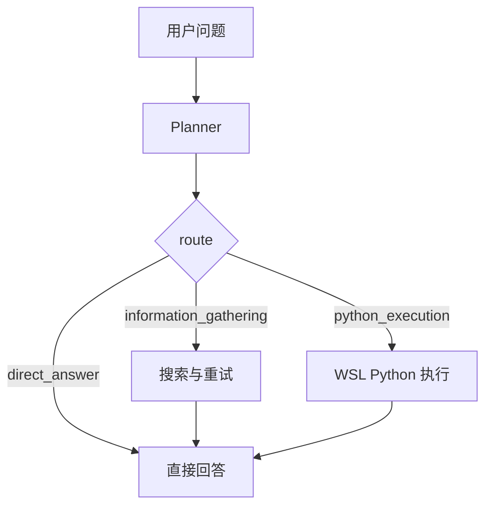

# Minimal Search Agent

一个基于 `FastAPI` 的轻量 Search Agent Demo。当前版本已经不是最早的单轮问答原型，而是一个包含会话记忆、流式输出、搜索增强、附件、Canvas 文档、Mermaid 渲染、中断回滚和 WSL Python 执行能力的可运行 demo。

## 当前能力

- 轻规划执行链路
  - `direct_answer`
  - `information_gathering`
  - `python_execution`
- 统一 Tool Schema
  - `search_web`
  - `save_markdown_artifact`
  - `execute_python_wsl`
- 搜索阶段动态重试
  - 最多 3 次搜索尝试
  - 搜索后由模型判断 `answer / retry / stop`
- WSL Python 执行
  - 临时脚本写入 `target/temp/`
  - 执行后返回 `stdout / stderr / exit_code`
  - 执行结束删除临时脚本
- 流式问答接口
  - `POST /api/ask/stream`
  - NDJSON 事件流
- 会话记忆
  - 每个会话持久化为一个 Markdown 文件
  - 历史消息、每轮日志、每轮引用来源一起保存
- 中断与回滚
  - 运行中可取消
  - 未完成轮次不会写入正式会话记忆
  - 附件和 Canvas 副作用会一起回滚
- 附件上传
  - 支持 `PDF / TXT / MD`
- Canvas 文档
  - 会话级 Markdown 文档
  - 支持生成、编辑、保存、下载
- Mermaid 渲染
  - 回答区和 Canvas 预览支持 ` ```mermaid ` 代码块
- 每轮过程可见
  - 执行日志挂在对应回答下
  - 流式生成时展开，完成后折叠
- 左侧历史会话
  - 可展开 / 收起

## 当前架构

当前不是旧的 `search / canvas / final` 同级动作循环，而是更轻的分层结构：

```text
用户问题
  -> Planner
  -> route = direct_answer | information_gathering | python_execution
  -> information_gathering 内部按需搜索与重试
  -> python_execution 内部生成 Python 并执行
  -> Final Answer
  -> Canvas Postprocess(optional)
  -> 提交完整轮次
```

更具体一点：

1. 前端提交问题和可选附件
2. Runtime 调用 Planner，决定粗方向
3. 如果需要外部信息，进入 `information_gathering`
4. 如果需要代码执行，进入 `python_execution`
5. 搜索或 Python 工具结果回填为统一 `ToolObservation`
6. 生成最终答案
7. 如果用户明确要求保存 Markdown 文档，再执行 Canvas 后处理
8. 本轮成功后才写入会话记忆

## Prompt 分层

当前模型看到的是三层上下文，而不是单一大 prompt：

1. 全局工具上下文
   - 当前有哪些工具
   - 每个工具的用途和参数
2. 当前计划
   - `direct_answer / information_gathering / python_execution`
   - 是否请求 Canvas
3. 当前进展 / 工具结果
   - 已执行过哪些工具
   - 成功还是失败
   - 当前已有的结果和证据

这样做的目的，是让模型同时知道：

- 我有什么能力
- 这轮准备怎么做
- 现在已经做到哪一步了

## 当前工具

### `search_web`

查询公开网页信息，返回标准化搜索结果。

### `save_markdown_artifact`

创建或更新当前会话的 Markdown 文档。

### `execute_python_wsl`

在 WSL 中执行 Python 代码，返回：

- `stdout`
- `stderr`
- `exit_code`

## 技术栈

- Backend: `FastAPI`
- LLM: `DeepSeek`
- Search: `Tavily`
- Python Execution: `WSL + python3`
- Frontend: 原生 `HTML / CSS / JS`
- Markdown: `marked` + `DOMPurify`
- Diagram: `Mermaid`

## 目录结构

```text
app/
  main.py
  runtime.py
  llm_client.py
  search_tool.py
  session_store.py
  attachment_store.py
  artifact_store.py
  artifact_tool.py
  tool_registry.py
  python_executor.py
  run_manager.py
  schemas.py
templates/
  index.html
tests/
target/
  sessions/
  uploads/
  artifacts/
  temp/
```

## 安装

```bash
pip install -r requirements.txt
```

## 配置

复制 `.env.example` 到 `.env`：

```bash
copy .env.example .env
```

必填：

- `DEEPSEEK_API_KEY`
- `TAVILY_API_KEY`

常用配置：

- `DEEPSEEK_MODEL=deepseek-chat`
- `DEEPSEEK_BASE_URL=https://api.deepseek.com`
- `SEARCH_TOP_K=10`
- `LLM_REQUEST_TIMEOUT=90`
- `SEARCH_REQUEST_TIMEOUT=20`
- `PYTHON_EXECUTION_TIMEOUT=30`
- `WSL_DISTRO_NAME=Ubuntu-24.04`
- `WSL_PYTHON_COMMAND=python3`
- `LOG_LEVEL=INFO`
- `PROXY_URL=`

## 启动

```bash
uvicorn app.main:app --reload
```

打开：

- `http://127.0.0.1:8000`

## 主要接口

- `POST /api/ask`
  - 同步返回完整答案
- `POST /api/ask/stream`
  - 流式返回 NDJSON 事件
- `POST /api/runs/{run_id}/cancel`
  - 取消当前运行
- `GET /api/sessions`
  - 会话列表
- `GET /api/sessions/{session_id}`
  - 会话详情
- `DELETE /api/sessions/{session_id}`
  - 删除会话、附件和文档
- `GET /api/sessions/{session_id}/artifacts`
  - 会话文档列表
- `POST /api/sessions/{session_id}/artifacts/save`
  - 创建或更新 Markdown 文档
- `GET /api/sessions/{session_id}/artifacts/{artifact_id}`
  - 读取文档
- `GET /api/sessions/{session_id}/artifacts/{artifact_id}/download`
  - 下载 Markdown 文档

## Mermaid 使用方式

回答区和 Canvas 预览支持 Mermaid 代码块，例如：

````md

````

当前更适合使用 Mermaid 的场景：

- 流程图
- 时序图
- 架构图

如果要做柱状图、折线图、饼图等统计图表，后续更建议接入 `ECharts` 或 `Chart.js`，而不是继续用 Mermaid 模拟数据图表。

## 中断策略

当前采用“整轮原子提交”：

- 运行中可以取消
- 取消后当前轮次不写入正式会话记忆
- 前端恢复到上一轮已完成状态
- 本轮附件与 Canvas 副作用回滚

也就是说：

- 要么这一轮完整提交
- 要么这一轮完全不提交

## 当前边界

- 还没有模型厂商原生 function calling
- 还没有真正的 token 级流式生成
- WSL Python 执行目前只返回文本结果，还没有完整文件产物展示
- Mermaid 目前只有前端渲染，没有专门的语法纠错
- 统计图表还没有独立图表引擎

## 下一步升级优化方向

建议按下面几个方向推进，优先级从高到低：

### 1. 标准 Tool Calling

把当前的自有 tool schema 逐步过渡到模型厂商原生 tool calling 协议。

收益：

- 工具边界更清楚
- 更接近业界主流实现
- 后续扩工具更自然

### 2. 图表能力

当前只支持 Mermaid，更适合流程图和结构图。下一步建议增加：

- `ECharts` 或 `Chart.js`

用于：

- 柱状图
- 折线图
- 饼图
- 散点图

### 3. Python 执行增强

当前已经支持 WSL Python 执行。后续可继续增强：

- 文件产物回传
- 图片图表预览
- 数据文件下载
- 更细的错误信息和资源限制

### 4. 更强的搜索评估与收口

当前已经有轻量搜索重试。后续可以继续增强：

- 查询改写更稳定
- 搜索结果去重
- 更清楚地表达“公开信息不足”
- 更合理的来源筛选

### 5. UI 信息架构继续收紧

当前 UI 已经从“全局面板”逐步调整成“每轮回答挂对应日志与引用”。后续还可以继续优化：

- 输入区更紧凑
- Canvas 工作区更像独立面板
- Python 执行结果独立展示
- 移动端布局适配

### 6. 可观测性与评估

如果 demo 要继续往产品走，这会越来越重要：

- 每轮 trace
- 工具调用统计
- 失败原因归类
- 搜索命中率和回答质量评估

## 测试

```bash
python -m unittest discover -s tests -v
python -m compileall app tests
```
