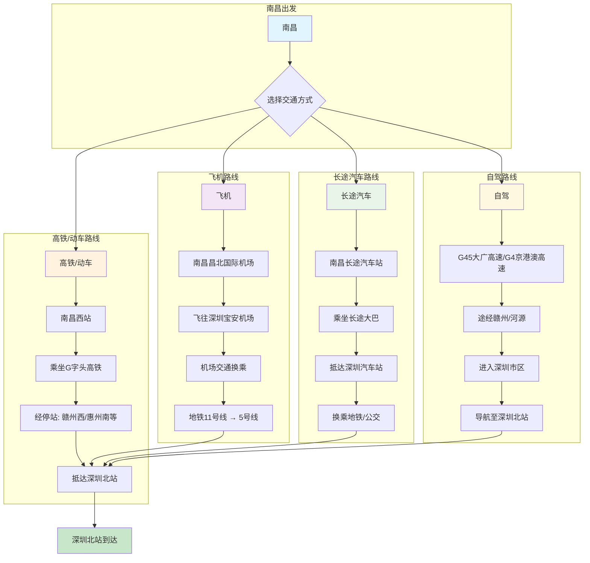

## 路线说明

### 1. 高铁/动车（推荐）
- **出发站**: 南昌西站
- **主要车次**: G字头高铁
- **经停站**: 常见经停赣州西、惠州南等站
- **运行时间**: 约3.5-4.5小时
- **票价**: 二等座约300-400元

### 2. 飞机
- **出发机场**: 南昌昌北国际机场
- **到达机场**: 深圳宝安机场
- **飞行时间**: 约1.5小时
- **机场到深圳北站**: 
  - 地铁11号线（机场站）→ 5号线（深圳北站）约50分钟
  - 出租车/网约车约40-60分钟

### 3. 长途汽车
- **出发站**: 南昌长途汽车站
- **运行时间**: 约8-10小时
- **票价**: 约200-300元
- **到达后换乘**: 需换乘地铁或公交至深圳北站

### 4. 自驾
- **主要路线**: 
  - G45大广高速（南昌-赣州-河源-深圳）
  - G4京港澳高速（南昌-韶关-广州-深圳）
- **行驶距离**: 约700-800公里
- **预计时间**: 8-10小时（不含休息）
- **过路费**: 约300-400元

## 建议
1. **高铁为首选**：时间短、舒适度高、准点率高
2. **提前购票**：高铁票建议提前1-2周购买
3. **深圳北站接驳**：站内可换乘地铁4、5、6号线，交通便利
4. **实时查询**：使用12306或各旅行APP查询最新班次信息