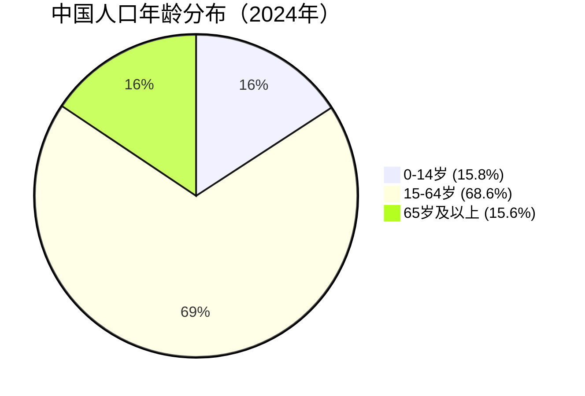

# 中国人口年龄分布饼状图

基于搜索结果中的最新数据（2024年），中国人口年龄分布如下：

## 数据来源
- 国家数据（2024年统计）
- 总人口：约14.08亿

## 年龄分布比例
| 年龄段 | 人口数量（万） | 占比 |
|--------|---------------|------|
| 0-14岁 | 22,240 | 15.8% |
| 15-64岁 | 96,565 | 68.6% |
| 65岁及以上 | 22,023 | 15.6% |
| **总计** | **140,828** | **100%** |

## 饼状图描述

## 关键观察
1. **劳动年龄人口（15-64岁）占主导**：占总人口的68.6%，是中国人口结构的主体
2. **老龄化趋势明显**：65岁及以上人口占比15.6%，已超过0-14岁人口（15.8%）
3. **少子化现象**：0-14岁人口比例相对较低，仅占15.8%

## 数据说明
- 数据基于国家统计局2024年统计
- 饼状图按三个主要年龄段划分，便于直观展示人口结构
- 此分布反映了中国当前的人口老龄化特征